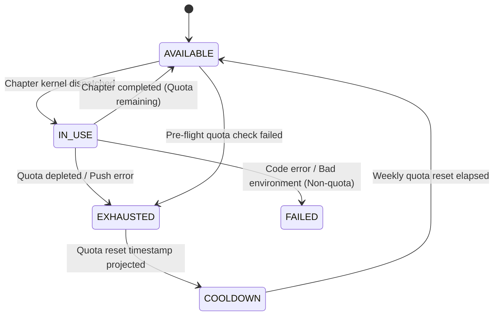

# Kaggle Multi-Account Production Pipeline Specification

## 1. Executive Summary & Objective

The **Kaggle Production Pipeline** is Noveler's distributed, zero-cost GPU compute orchestrator designed for heavy Stage C audio synthesis and batch model inference (e.g., Kokoro TTS, Chatterbox, VITS, or Large Audio Diffusion models).

Because commercial cloud GPU providers (AWS, GCP, RunPod, Lambda Labs) incur significant hourly costs for long-running novel synthesis (an 80-hour audiobook requires ~20–30 hours of continuous GPU processing), Noveler leverages **Kaggle's free GPU compute tier** (30 hours/week of 2x Nvidia T4 or 1x Nvidia P100 per account).

### 1.1 The Fundamental Rule: Chapter-by-Chapter Execution
Inherited directly from the production-proven architecture in `chatterbox-attribution`, **Kaggle production does NOT run on arbitrary line or token batches. Every single Kaggle kernel run corresponds to exactly one chapter.**

- **Atomic Scope**: Each kernel is dedicated to a single chapter (e.g., `noveler-chapter-001`, `noveler-chapter-043`), generating that chapter's master audio artifact (`chapter_043.m4a` / `chapter_043.wav`).
- **Short, Safe Execution**: A 3,000-word chapter takes ~15–35 minutes of GPU time—well below Kaggle's 9-hour limit—eliminating kernel timeouts and memory fragmentation.
- **Clean Failure & Quota Boundary**: If Account 1 completes Chapter 6 and exhausts its weekly GPU quota, Chapters 1–6 are 100% complete and verified. Chapter 7 is simply dispatched as an independent kernel to **Account 2**.
- **Multi-Account Failover Pool**: When an account's quota runs out, the orchestrator seamlessly routes the next chapter to the next available account in the pool. When all accounts are exhausted, the pipeline pauses until weekly reset.

---

## 2. Kaggle Compute Constraints & Quota Mechanics

Understanding Kaggle's internal limitations is critical for building a robust orchestration layer.

### 2.1 Hardware & Quota Thresholds
| Parameter | Free Tier Value | Implications for Noveler |
| :--- | :--- | :--- |
| **Weekly GPU Quota** | **30 hours per account** | A single account can synthesize ~100k–150k words. A 1M-word novel requires 4–6 accounts. |
| **Quota Reset Schedule** | Every 7 days (rolling or fixed weekly reset) | The orchestrator tracks timestamp of first usage to project reset time. |
| **Max Committed Kernel Time** | **9 hours (540 minutes)** per run | Chapter-level runs (15–45 min) comfortably stay within this boundary. |
| **Concurrent Active GPU Kernels** | **1 active GPU kernel** per account | The orchestrator dispatches 1 chapter kernel per account at any time. |
| **Local Disk Space** | 20 GB scratch disk (`/kaggle/working`) | Chapter master and segment takes are packaged and uploaded directly to R2. |
| **Internet Access** | Enabled (requires SMS-verified phone) | All accounts must have internet enabled to download weights and upload audio. |

### 2.2 Error Signatures for Quota Depletion
When Kaggle runs out of quota, it does not always return a clean HTTP 403. The orchestrator detects all 3 exhaustion signatures:
1. **API Push Rejection (Pre-flight)**:
   - `kaggle kernels push` returns HTTP 400 or HTTP 403 with message:
   ```json
   {"code": 400, "message": "You have exceeded your GPU quota for this week."}
   ```
2. **Kernel Startup Abort**:
   - Kernel transitions to status `failed` within 30 seconds of queueing with error:
   ```
   "GPU quota exceeded. You have 0 hours remaining this week."
   ```
3. **In-Flight Quota Termination**:
   - A running chapter kernel is terminated mid-execution when the weekly clock strikes 0:
   - Kernel status transitions from `running` → `failed` with exit code `137` or log:
   ```
   "Kernel cancelled due to GPU quota exhaustion."
   ```

---

## 3. Multi-Account Credential Configuration (`.env`)

The pipeline supports two configuration formats in `.env` to accommodate varying developer setups: **Indexed Variables** (standard) and **JSON String** (cloud secret stores).

### 3.1 Option A: Indexed Environment Variables (Recommended)
Add as many accounts as needed using the `KAGGLE_ACCOUNT_<INDEX>_*` convention:

```env
# ==============================================================================
# Kaggle Production Multi-Account Pool
# ==============================================================================

# Primary Account
KAGGLE_ACCOUNT_1_USERNAME="noveler_runner_01"
KAGGLE_ACCOUNT_1_KEY="9a4b2c1d8e7f6035123456789abcdef0"
KAGGLE_ACCOUNT_1_PRIORITY=1

# Secondary Failover Account
KAGGLE_ACCOUNT_2_USERNAME="noveler_runner_02"
KAGGLE_ACCOUNT_2_KEY="1b2c3d4e5f6a7b8c9d0e1f2a3b4c5d6e"
KAGGLE_ACCOUNT_2_PRIORITY=2

# Tertiary Failover Account
KAGGLE_ACCOUNT_3_USERNAME="noveler_runner_03"
KAGGLE_ACCOUNT_3_KEY="fae0bd31849204781290384750192834"
KAGGLE_ACCOUNT_3_PRIORITY=3

# Chapter polling interval in seconds
KAGGLE_POLL_INTERVAL_SECONDS=45

# Maximum execution runtime before safe kernel self-termination (in minutes)
KAGGLE_MAX_KERNEL_RUNTIME_MINUTES=360
```

### 3.2 Option B: JSON String Environment Variable
Ideal for Docker deployments, GitHub Actions, or AWS ECS Secrets Manager:

```env
KAGGLE_ACCOUNTS_JSON='[
  {"username": "noveler_runner_01", "key": "9a4b2c1d8e7f6035123456789abcdef0", "priority": 1},
  {"username": "noveler_runner_02", "key": "1b2c3d4e5f6a7b8c9d0e1f2a3b4c5d6e", "priority": 2},
  {"username": "noveler_runner_03", "key": "fae0bd31849204781290384750192834", "priority": 3}
]'
```

### 3.3 Dynamic Account Discovery Logic
Upon FastAPI startup, `KaggleAccountManager` executes the discovery sequence:
1. Checks if `KAGGLE_ACCOUNTS_JSON` is populated. If yes, parses the array.
2. If absent, iterates through indices `i = 1, 2, ...` checking `KAGGLE_ACCOUNT_{i}_USERNAME` and `KAGGLE_ACCOUNT_{i}_KEY`.
3. Validates each credential against the Kaggle API endpoint (`GET https://www.kaggle.com/api/v1/users/{username}`).
4. Orders accounts by `priority` ascending (1 → 2 → 3).
5. Populates an in-memory/database registry with state `AVAILABLE`.

---

## 4. Account Pool & Chapter Failover State Machine

### 4.1 State Definitions
Each account in the pool resides in one of five states:



- **`AVAILABLE`**: Valid credentials, quota verified > 0, ready to receive a chapter kernel.
- **`IN_USE`**: Account is currently running a chapter kernel on Kaggle.
- **`EXHAUSTED`**: Account has exhausted its 30-hour weekly GPU allowance. Kept in pool but skipped during dispatch.
- **`COOLDOWN`**: Waiting for the projected 7-day weekly reset timer.
- **`FAILED`**: Account credential revoked or invalid. Excluded permanently until updated.

### 4.2 Chapter Dispatch & Cascade Algorithm

```
                  ┌───────────────────────────────┐
                  │ Next Pending Chapter (Ch. N)  │
                  └──────────────┬────────────────┘
                                 │
                 ┌───────────────▼───────────────┐
                 │ Pick Next AVAILABLE Account   │
                 └───────────────┬───────────────┘
                                 │
                        Is Pool Exhausted?
                       /                  \
                    [Yes]                [No]
                     /                      \
┌──────────────────────────────┐    ┌──────────────────────────────┐
│  ALL ACCOUNTS EXHAUSTED      │    │ Dispatch Kernel for Ch. N    │
│  - Pause production job      │    │ with Active Account [i]      │
│  - Calculate earliest reset  │    └──────────────┬───────────────┘
│  - Notify user in UI         │                   │
└──────────────────────────────┘          Monitor Chapter Kernel
                                           (Polling every 45s)
                                                   │
                                      ┌────────────┴────────────┐
                                      │                         │
                                 [Completed]               [Terminated]
                                      │                         │
                            Save Ch. N master audio        Check Reason:
                            Mark Ch. N as "complete"    ┌───────┴───────┐
                            Proceed to Ch. N+1          │               │
                            (Keep using Acc [i])   [GPU Quota]     [Script Error]
                                                        │               │
                                               Mark Acc [i] as      Retry Ch. N
                                                 EXHAUSTED         on same acc
                                                        │
                                               Dispatch Ch. N to
                                               Next Acc [i+1]
```

### 4.3 Multi-Lane Mode (Parallel Chapter Synthesis)
Like the `lane-a`, `lane-b`, `lane-c` system in `chatterbox-attribution`:
- If the user has **3 active Kaggle accounts** with available quotas, Noveler can run **parallel chapter lanes**:
  - `Account 1` runs `Chapter 001` (Lane A)
  - `Account 2` runs `Chapter 002` (Lane B)
  - `Account 3` runs `Chapter 003` (Lane C)
- When any lane finishes its chapter, it immediately pulls the next pending chapter (`Chapter 004`).
- If an account in any lane exhausts its quota, that lane drops out of the pool while remaining lanes continue running until the entire pool is depleted.

---

## 5. Chapter Checkpointing & Delivery Protocol

Because work is organized chapter-by-chapter, delivery is clean, isolated, and resilient.

### 5.1 Remote Checkpointing via Cloudflare R2 / S3
The Kaggle worker kernel does **not** rely on persistent local storage between runs. During chapter synthesis:
1. **Segment Audio Synthesis**:
   - Each dialogue and narrative line is synthesized and verified locally on the Kaggle runner.
2. **Chapter Master Compilation**:
   - The runner stitches segments with natural pacing/pauses into the master chapter audio file (`chapter_043.m4a`).
3. **Atomic Chapter Upload**:
   - The master file and segment takes are uploaded to Cloudflare R2 via presigned URLs.
4. **Database Progress Update**:
   - The worker sends an authenticated HTTP callback to Noveler API:
     `POST /api/v1/projects/{project_id}/chapters/{chapter_id}/complete`
     ```json
     {
       "chapter_number": 43,
       "storage_path": "projects/126d4001/audio/chapter_043.m4a",
       "duration_seconds": 1840.5,
       "total_segments": 142
     }
     ```
5. **Chapter Status Update**:
   - Noveler sets `chapters.status = "complete"`. The chapter canvas in the UI immediately reflects the playable audio preview!

### 5.2 Next Account Bootstrapping
When Account 1 exhausts its quota on Chapter 44:
- The orchestrator detects the failure, marks Account 1 as `EXHAUSTED`.
- Chapter 44 is immediately pushed as a new, clean kernel to Account 2.
- Chapters 1–43 remain safely in storage and marked `complete`. Zero re-computation, zero lost tokens.

---

## 6. Kaggle API Automation Mechanics (Chapter Runner)

The orchestrator interacts with Kaggle programmatically via the official Kaggle REST API, following the `run_chapter.py.tmpl` pattern from `chatterbox-attribution`.

### 6.1 Programmatic Chapter Kernel Generation
For every chapter run, Noveler creates an isolated temporary directory containing:

1. **`kernel-metadata.json`**:
```json
{
  "id": "{username}/noveler-chapter-{chapter_number:03d}-lane-{lane_id}-v1",
  "title": "Noveler Chapter {chapter_number:03d} Production",
  "code_file": "run_chapter.py",
  "language": "python",
  "kernel_type": "script",
  "is_private": "true",
  "enable_gpu": "true",
  "enable_tpu": "false",
  "enable_internet": "true",
  "dataset_sources": [
    "{username}/noveler-runtime-assets-v1-private"
  ],
  "competition_sources": [],
  "kernel_sources": []
}
```

2. **`run_chapter.py` (Synthesized Chapter Runner Script)**:
- Generated from `run_chapter.py.tmpl`.
- Injects:
  - `CHAPTER_NUMBER`: e.g., `43`
  - Assigned character voices and speaker maps
  - Pronunciation phoneme replacements
  - Presigned upload URLs for audio outputs
- Executes:
  - Unpacks cached model bundle from the private dataset dependency (`noveler-runtime-assets-v1-private`) to avoid reinstalling PyTorch/Kokoro on every run.
  - Synthesizes all segments in Chapter 43.
  - Runs automated QC / transcript verification.
  - Generates master audio and uploads to R2.

### 6.2 CLI / SDK Operations
```bash
# Set temporary credentials for the active account
export KAGGLE_USERNAME="$ACTIVE_ACCOUNT_USERNAME"
export KAGGLE_KEY="$ACTIVE_ACCOUNT_KEY"

# 1. Push chapter kernel code to Kaggle
kaggle kernels push -p /tmp/noveler_kernel_chapter_043

# 2. Check execution status (queued, running, complete, error)
kaggle kernels status "$ACTIVE_ACCOUNT_USERNAME/noveler-chapter-043-lane-a-v1"

# 3. Stream real-time kernel output logs
kaggle kernels output "$ACTIVE_ACCOUNT_USERNAME/noveler-chapter-043-lane-a-v1" -p /tmp/chapter_043_logs

# 4. Emergency abort if stalled
# (Via REST API: POST https://www.kaggle.com/api/v1/kernels/cancel)
```

---

## 7. Architecture & Monorepo Integration Plan

```
noveler/
├── apps/
│   ├── api/
│   │   ├── app/
│   │   │   ├── models/
│   │   │   │   ├── kaggle_account.py      <-- Account pool database model
│   │   │   │   └── audio_job.py           <-- Stage C audio generation jobs
│   │   │   ├── services/
│   │   │   │   ├── kaggle_account_pool.py <-- Multi-account discovery & rotation
│   │   │   │   ├── kaggle_dispatcher.py   <-- Chapter metadata generation & kernel pushing
│   │   │   │   └── audio_orchestrator.py  <-- Chapter dispatch & lane coordinator
│   │   │   └── core/
│   │   │       └── scheduler.py           <-- 45-second APScheduler status poller
│   └── web/
│       └── src/
│           └── pages/(main)/project-workspace/
│               └── components/
│                   ├── stage-c-audio-panel.tsx     <-- Stage C audio synthesis tab
│                   ├── kaggle-pool-indicator.tsx   <-- Account rotation & quota indicator
│                   └── quota-exhausted-modal.tsx   <-- All-accounts-exhausted recovery countdown
```

### 7.1 Proposed Database Models
```python
# app/models/kaggle_account.py
class KaggleAccountModel(Base):
    __tablename__ = "kaggle_accounts"

    id: Mapped[str] = mapped_column(String(36), primary_key=True)
    username: Mapped[str] = mapped_column(String(100), unique=True, nullable=False)
    encrypted_key: Mapped[str] = mapped_column(String(255), nullable=False)
    priority: Mapped[int] = mapped_column(Integer, default=1)
    status: Mapped[str] = mapped_column(String(50), default="available")  # available, in_use, exhausted, failed
    last_used_at: Mapped[datetime | None] = mapped_column(DateTime(timezone=True))
    exhausted_at: Mapped[datetime | None] = mapped_column(DateTime(timezone=True))
    estimated_reset_at: Mapped[datetime | None] = mapped_column(DateTime(timezone=True))
    total_hours_used: Mapped[float] = mapped_column(Float, default=0.0)
```

---

## 8. Web UI Management: Profile "Kaggle Settings" Tab

While `.env` variables serve as ideal defaults for headless server environments, users must be able to view, add, verify, prioritize, and delete Kaggle accounts directly within the Noveler Web application without editing configuration files or restarting the server.

### 8.1 Profile Page Navigation & Architecture
In `apps/web/src/pages/(main)/profile/index.tsx`, a third tab titled **`Kaggle Settings`** is mounted alongside `Personal` and `Security`:

```tsx
<Tabs defaultValue="personal" className="w-full space-y-6">
  <TabsList className="bg-transparent border-b border-border w-full justify-start rounded-none p-0 h-auto gap-8">
    <TabsTrigger value="personal">Personal</TabsTrigger>
    <TabsTrigger value="security">Security</TabsTrigger>
    <TabsTrigger value="kaggle">Kaggle Settings</TabsTrigger>
  </TabsList>

  <TabsContent value="personal"><PersonalTab ... /></TabsContent>
  <TabsContent value="security"><SecurityTab ... /></TabsContent>
  <TabsContent value="kaggle"><KaggleSettingsTab ... /></TabsContent>
</Tabs>
```

- **Tab Component**: `apps/web/src/pages/(main)/profile/components/kaggle-settings-tab.tsx`
- **Dialog Component**: `apps/web/src/pages/(main)/profile/components/add-kaggle-account-dialog.tsx`
- **Frontend Service**: `apps/web/src/services/kaggle-settings.ts`

---

### 8.2 UI Layout & Feature Specifications

#### A. Pooled Capacity Overview Card
Positioned at the top of the **Kaggle Settings** tab:
- **Pool Capacity Metrics**: Displays total pooled GPU compute (e.g., `3 Active Accounts · ~90 GPU Hours/Week Available`).
- **Live Status Badges**:
  - `Available`: Accounts ready to accept jobs immediately.
  - `In Use`: Accounts currently executing an active kernel.
  - `Exhausted`: Accounts waiting for their 7-day quota reset.
- **Global Dispatch Switch**: A master toggle to pause all Kaggle remote offloading (falling back to local CPU/API synthesis) without needing to delete stored accounts.
- **"Add Kaggle Account" Button**: Primary action button opening the addition modal.

#### B. Interactive Accounts Roster Table / Card Grid
A clean, card-based list showing each configured account in priority order:
- **Priority Indicator**: `#1 (Primary)`, `#2 (Failover)`, `#3 (Failover)` with move up/down priority controls.
- **Kaggle Handle**: Account username with an external link to their Kaggle profile.
- **Masked Token Preview**: Key displayed as `••••••••••••••••8f2a` with a copy-to-clipboard button.
- **Live Quota Meter**: Visual bar estimating weekly hours consumed out of the 30-hour limit.
- **Status Indicator**:
  - 🟢 **Available** (verified, GPU hours remaining > 0)
  - 🔵 **In Use** (currently running a kernel, links to live Kaggle run)
  - 🟠 **Exhausted** (shows countdown timer: `Resets in 3d 14h`)
  - 🔴 **Invalid** (token rejected or SMS phone verification missing)
- **Account Actions**:
  - **`Test Connection`**: Instantly pings Kaggle's REST API (`/api/v1/users/{username}`) from the FastAPI backend to verify the token is valid, active, and has GPU quota.
  - **`Edit`**: Update the API key or modify priority.
  - **`Toggle Active`**: Temporarily bypass an account in the failover cascade without deleting it.
  - **`Delete`**: Permanently removes the account from the pool.

#### C. Add / Edit Account Dialog (`AddKaggleAccountDialog`)
- **Direct Form Inputs**:
  - `Username`: The Kaggle username (e.g., `noveler_runner_01`).
  - `API Key`: The 32-character hexadecimal token.
  - `Priority Rank`: Integer ranking (1 for highest priority).
- **`kaggle.json` File Dropzone**:
  - Allows users to drag and drop their downloaded `kaggle.json` file directly from their browser.
  - The frontend automatically parses the JSON structure (`{"username":"...","key":"..."}`) and auto-fills the form fields.
- **Pre-Flight Validation**:
  - Includes a "Verify Credentials" test button in the modal so users can test before saving.

#### D. Global Pipeline Execution Settings
Configurable controls located below the accounts table:
- **Status Polling Frequency**: Slider/number input (default: `45 seconds`, range: `20s–120s`).
- **Maximum Kernel Execution Timeout**: Slider/number input (default: `360 minutes / 6 hours`, max: `540 minutes / 9 hours`).
- **Auto-Failover Behavior**: Toggle to automatically resume on the next account when quota is depleted.

---

### 8.3 Backend API Endpoints for User-Managed Accounts

```python
# apps/api/app/api/v1/endpoints/kaggle_settings.py

router = APIRouter(prefix="/profile/kaggle", tags=["kaggle-settings"])

@router.get("/accounts", response_model=ApiResponse[list[KaggleAccountResponse]])
async def list_kaggle_accounts(...)
    """List all configured Kaggle accounts with masked keys and live quota status."""

@router.post("/accounts", response_model=ApiResponse[KaggleAccountResponse])
async def add_kaggle_account(payload: KaggleAccountCreate, ...)
    """Add a new Kaggle account with pre-flight credential verification."""

@router.put("/accounts/{account_id}", response_model=ApiResponse[KaggleAccountResponse])
async def update_kaggle_account(account_id: str, payload: KaggleAccountUpdate, ...)
    """Update priority, active status, or credentials for an existing account."""

@router.delete("/accounts/{account_id}", response_model=ApiResponse[dict])
async def delete_kaggle_account(account_id: str, ...)
    """Remove a Kaggle account from the user's failover pool."""

@router.post("/accounts/{account_id}/test", response_model=ApiResponse[KaggleAccountTestResponse])
async def test_kaggle_account(account_id: str, ...)
    """Test connection against Kaggle API and verify GPU access."""

@router.get("/settings", response_model=ApiResponse[KaggleGlobalSettingsResponse])
async def get_kaggle_settings(...)
    """Get global orchestrator settings (polling interval, max runtime)."""

@router.put("/settings", response_model=ApiResponse[KaggleGlobalSettingsResponse])
async def update_kaggle_settings(payload: KaggleGlobalSettingsUpdate, ...)
    """Update global orchestrator settings."""
```

### 8.4 Precedence Hierarchy: Database vs. `.env` Accounts
To ensure maximum flexibility:
1. **Database Accounts (UI-Managed)**: Always take highest precedence. When accounts are configured via the Web UI, they form the primary pool.
2. **`.env` Accounts (Fallback / Headless)**: If no database accounts are present, or if configured to merge, `.env` accounts are imported as system fallback accounts.
3. **Encryption at Rest**: Any API keys entered via the Web UI are encrypted before storage in the PostgreSQL/SQLite database using AES-256-GCM / Fernet, ensuring secrets are never visible in plaintext.

---

## 9. Failure Modes, Rate Limits & Edge Cases Runbook

### Case 1: All Kaggle Accounts Exhausted
- **Trigger**: Every account in the pool returns `GPU quota exceeded`.
- **System Action**:
  1. The orchestrator flags the active production job as `paused_quota_exhausted`.
  2. Calculates the earliest reset date based on `min(account.exhausted_at + 7 days)`.
  3. In the UI, the top bar changes to an orange amber pill:
     `[All Kaggle GPU quotas exhausted · Resumes automatically in 3d 14h]`.
  4. APScheduler sets a scheduled wake-up job at `min(estimated_reset_at)`.
  5. When the timer elapses, accounts are marked `AVAILABLE` and processing resumes automatically.

### Case 2: In-Flight Kernel Cancellation (Mid-Chapter)
- **Trigger**: Kaggle kills a kernel after 8.5 hours due to max session duration.
- **System Action**:
  - The orchestrator detects status `failed` with session timeout.
  - Inspects R2 storage: discovers segments 1–142 of Chapter 8 were successfully uploaded before the kill.
  - Spawns the next kernel targeting Chapter 8 segment 143 forward.

### Case 3: Kaggle API Rate Limiting (HTTP 429)
- **Trigger**: Querying `kaggle kernels status` too frequently.
- **System Action**:
  - The orchestrator applies an exponential backoff jitter:
    `poll_interval = min(300, base_interval * (1.5 ** attempt))`.
  - Normal polling interval is kept at a gentle 45 seconds per active account.

### Case 4: Cloudflare R2 Upload Network Blip on Kaggle
- **Trigger**: Kaggle runner encounters a transient network drop while uploading a 20MB WAV file.
- **System Action**:
  - The worker script implements `urllib3` retry logic with 5 exponential backoff attempts.
  - If upload permanently fails, segment is kept in local scratch; worker attempts batch zip upload at the end of the chapter.

---

## 10. Implementation Checklist (For Future Phase)

When ready to implement Stage C and the Kaggle orchestrator, follow these milestones:

1. [ ] **Environment Setup**: Define `KAGGLE_ACCOUNT_*` schemas in `apps/api/app/core/config.py`.
2. [ ] **Database Migration**: Create `KaggleAccountModel` and `AudioProductionJobModel` with encrypted key fields.
3. [ ] **Profile Settings Endpoints**: Implement `/api/v1/profile/kaggle/accounts` and credential test probe.
4. [ ] **Frontend Profile Tab**: Build `<KaggleSettingsTab />` in `apps/web/src/pages/(main)/profile/` with `kaggle.json` dropzone.
5. [ ] **Account Pool Manager**: Implement `KaggleAccountPoolService` with `get_next_available_account()`, `mark_exhausted()`, and reset projections.
6. [ ] **Worker Template**: Develop the standalone `worker.py` script equipped with R2 streaming uploads and Noveler heartbeat pings.
7. [ ] **Dispatcher Service**: Implement programmatic kernel push via Kaggle REST API.
8. [ ] **APScheduler Monitor**: Add recurring 45-second heartbeat job to check kernel statuses and trigger failovers.
9. [ ] **Frontend Workspace Components**: Build `<KagglePoolIndicator />` and `<StageCAudioPanel />` showing active account, remaining quota, and failover status.

